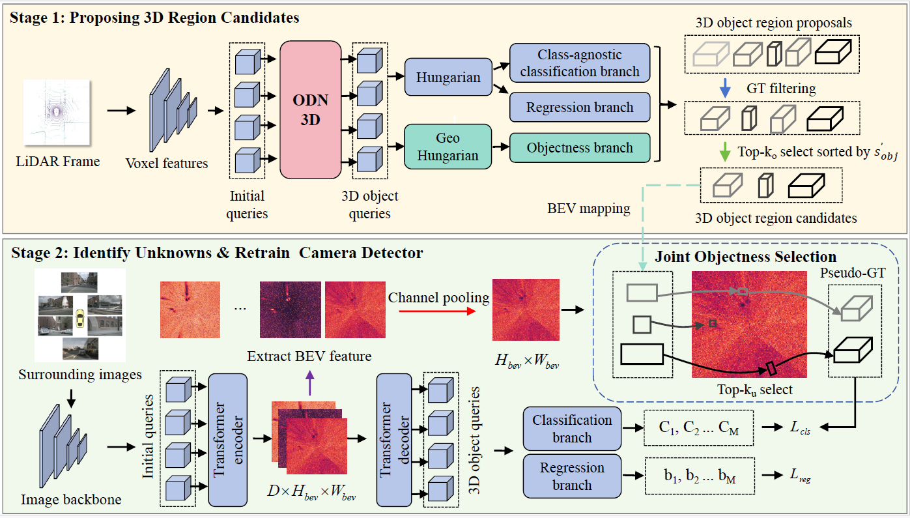

<div align="center">   
  
# Towards Camera Open-set 3D Object Detection
</div>

> **Towards Camera Open-set 3D Object Detection**


# News
</br>


# Abstract
Traditional camera 3D object detectors are typically trained to recognize a predefined set of known object classes. In real-world scenarios, these detectors may encounter unknown objects outside the training categories and fail to identify them correctly. To address this gap, we present OS-Det3D (Open-set Camera 3D Object Detection), a two-stage training framework enhancing the ability of camera 3D detectors to identify both known and unknown objects. The framework involves our proposed 3D Object Discovery Network (ODN3D), which is specifically trained using geometric cues such as the location and scale of 3D boxes to discover general 3D objects. ODN3D is trained in a class-agnostic manner, and the provided 3D object region proposals inherently come with data noise. To boost accuracy in identifying unknown objects, we introduce a Joint Objectness Selection (JOS) module. JOS selects the pseudo ground truth for unknown objects from the 3D object region proposals of ODN3D by combining the ODN3D objectness and camera feature attention objectness. Experiments on the nuScenes and KITTI datasets demonstrate the effectiveness of our framework in enabling camera 3D detectors to successfully identify unknown objects while also improving their performance on known objects.


# Methods



# Getting Started
- [Installation](docs/install.md) 
- [Prepare Dataset](docs/prepare_dataset.md)
- [Run and Eval](docs/getting_started.md)

# Model Zoo

<!-- | Backbone | Method | Lr Schd | NDS| mAP|memroy | Config | Download |
| :---: | :---: | :---: | :---: | :---:|:---:| :---: | :---: |
| R50 | BEVFormer-tiny_fp16 | 24ep | 35.9|25.7 | - |[config](projects/configs/bevformer_fp16/bevformer_tiny_fp16.py) |[model](https://github.com/zhiqi-li/storage/releases/download/v1.0/bevformer_tiny_fp16_epoch_24.pth)/[log](https://github.com/zhiqi-li/storage/releases/download/v1.0/bevformer_tiny_fp16_epoch_24.log) |
| R50 | BEVFormer-tiny | 24ep | 35.4|25.2 | 6500M |[config](projects/configs/bevformer/bevformer_tiny.py) |[model](https://github.com/zhiqi-li/storage/releases/download/v1.0/bevformer_tiny_epoch_24.pth)/[log](https://github.com/zhiqi-li/storage/releases/download/v1.0/bevformer_tiny_epoch_24.log) |
| [R101-DCN](https://github.com/zhiqi-li/storage/releases/download/v1.0/r101_dcn_fcos3d_pretrain.pth)  | BEVFormer-small | 24ep | 47.9|37.0 | 10500M |[config](projects/configs/bevformer/bevformer_small.py) |[model](https://github.com/zhiqi-li/storage/releases/download/v1.0/bevformer_small_epoch_24.pth)/[log](https://github.com/zhiqi-li/storage/releases/download/v1.0/bevformer_small_epoch_24.log) |
| [R101-DCN](https://github.com/zhiqi-li/storage/releases/download/v1.0/r101_dcn_fcos3d_pretrain.pth)  | BEVFormer-base | 24ep | 51.7|41.6 |28500M |[config](projects/configs/bevformer/bevformer_base.py) | [model](https://github.com/zhiqi-li/storage/releases/download/v1.0/bevformer_r101_dcn_24ep.pth)/[log](https://github.com/zhiqi-li/storage/releases/download/v1.0/bevformer_r101_dcn_24ep.log) |
| [R50](https://pan.baidu.com/s/1Jh5Aq2YwcD6tdj7Sl5BB3g?pwd=5rij)  | BEVformerV2-t1-base | 24ep | 42.6 | 35.1 | 23952M |[config](projects/configs/bevformerv2/bevformerv2-r50-t1-base-24ep.py) | [model/log](https://pan.baidu.com/s/1ynzlAt1DQbH8NkqmisatTw?pwd=fdcv) |
| [R50](https://pan.baidu.com/s/1Jh5Aq2YwcD6tdj7Sl5BB3g?pwd=5rij)  | BEVformerV2-t1-base | 48ep | 43.9 | 35.9 | 23952M |[config](projects/configs/bevformerv2/bevformerv2-r50-t1-base-48ep.py) | [model/log](https://pan.baidu.com/s/1ynzlAt1DQbH8NkqmisatTw?pwd=fdcv) |
| [R50](https://pan.baidu.com/s/1Jh5Aq2YwcD6tdj7Sl5BB3g?pwd=5rij)  | BEVformerV2-t1 | 24ep | 45.3 | 38.1 | 37579M |[config](projects/configs/bevformerv2/bevformerv2-r50-t1-24ep.py) | [model/log](https://pan.baidu.com/s/1ynzlAt1DQbH8NkqmisatTw?pwd=fdcv) |
| [R50](https://pan.baidu.com/s/1Jh5Aq2YwcD6tdj7Sl5BB3g?pwd=5rij)  | BEVformerV2-t1 | 48ep | 46.5 | 39.5 | 37579M |[config](projects/configs/bevformerv2/bevformerv2-r50-t1-48ep.py) | [model/log](https://pan.baidu.com/s/1ynzlAt1DQbH8NkqmisatTw?pwd=fdcv) |
| [R50](https://pan.baidu.com/s/1Jh5Aq2YwcD6tdj7Sl5BB3g?pwd=5rij)  | BEVformerV2-t2 | 24ep | 51.8 | 42.0 | 38954M |[config](projects/configs/bevformerv2/bevformerv2-r50-t2-24ep.py) | [model/log](https://pan.baidu.com/s/1ynzlAt1DQbH8NkqmisatTw?pwd=fdcv) |
| [R50](https://pan.baidu.com/s/1Jh5Aq2YwcD6tdj7Sl5BB3g?pwd=5rij)  | BEVformerV2-t2 | 48ep | 52.6 | 43.1 | 38954M |[config](projects/configs/bevformerv2/bevformerv2-r50-t2-48ep.py) | [model/log](https://pan.baidu.com/s/1ynzlAt1DQbH8NkqmisatTw?pwd=fdcv) |
| [R50](https://pan.baidu.com/s/1Jh5Aq2YwcD6tdj7Sl5BB3g?pwd=5rij)  | BEVformerV2-t8 | 24ep | 55.3 | 46.0 | 40392M |[config](projects/configs/bevformerv2/bevformerv2-r50-t8-24ep.py) | [model/log](https://pan.baidu.com/s/1ynzlAt1DQbH8NkqmisatTw?pwd=fdcv) | -->

# Catalog
- [next] 3D Detection checkpoints
- [next] 3D Detection code
- [todo] Initialization


# Bibtex
If this work is helpful for your research, please consider citing the following BibTeX entry.

```

```

# Acknowledgement

Many thanks to these excellent open source projects:
- [bevformer](https://github.com/fundamentalvision/BEVFormer) 
- [detr3d](https://github.com/WangYueFt/detr3d) 
- [mmdet3d](https://github.com/open-mmlab/mmdetection3d)

